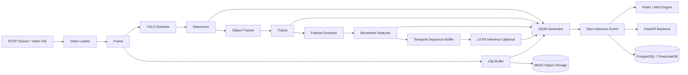
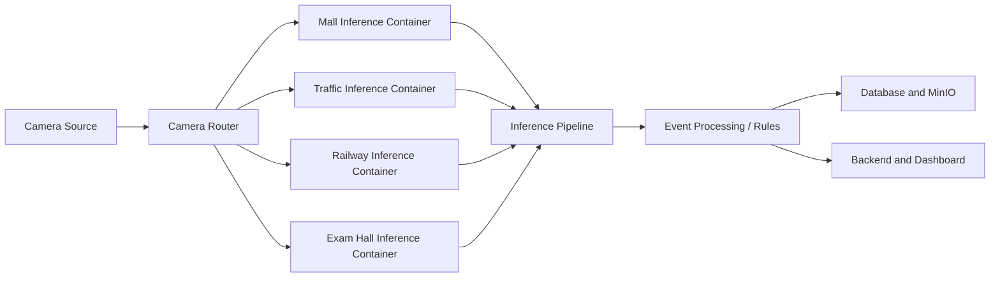

# Vision AI Inference Architecture

## Purpose

The inference layer converts a video stream into structured computer-vision
events. It processes frames, detects objects, tracks them over time, extracts
movement features, optionally predicts activities with an LSTM, and produces
JSON for the rules engine and backend.

## High-level architecture



## Where it fits in the complete system



Each environment container can use the same inference package with different
model files and rules:

| Container | Detector model | Additional processing |
|---|---|---|
| Mall | Mall YOLO model | Shopping and loitering rules |
| Traffic | `Traffic_best.pt` | Helmet, red-light, and wrong-way rules |
| Railway | Railway YOLO model | Track intrusion rules |
| Exam hall | `Exam_best.pt` | Cheating and pose rules |

## Frame-by-frame processing

For every input frame, the pipeline performs this sequence:

```text
1. Read frame
2. Detect objects
3. Match objects with existing tracks
4. Extract movement features
5. Add features to temporal sequence
6. Optionally run LSTM prediction
7. Store frame in rolling clip buffer
8. Generate standardized JSON
```

The pipeline emits one JSON record per processed frame. The rules engine can
later decide whether several frame-level records represent one real alert.

## Module responsibilities

### `video_loader.py`

Opens a local video, RTSP stream, or camera index and yields a `Frame` object:

```python
Frame(
    image=<decoded image>,
    frame_index=60,
    timestamp=3.0,
    fps=20.0,
    source="camera-or-file"
)
```

It is responsible for reading frames and releasing the video resource. It does
not perform detection.

### `yolo_inference.py`

Loads an Ultralytics YOLO model and runs object detection on the current image.

Output:

```json
{
  "class_id": 14,
  "class_name": "no-helmet",
  "confidence": 0.916,
  "bbox": [245.4, 67.5, 464.1, 336.2]
}
```

The model answers: **what objects are visible in this frame, and where are
they?**

### `tracker.py`

Associates detections from the current frame with detections from previous
frames. This creates a stable identity:

```text
Frame 60 → no-helmet → track_id 1
Frame 61 → no-helmet → track_id 1
Frame 62 → no-helmet → track_id 1
```

The current starter implementation uses centroid matching. Production traffic
and crowded-scene deployments should replace or extend it with ByteTrack.

### `feature_extractor.py`

Converts track history into numerical behavior features:

```json
{
  "track_id": 1,
  "center_x": 354.7,
  "center_y": 201.8,
  "velocity_x": 50.2,
  "velocity_y": -24.9,
  "speed": 56.1,
  "direction": -26.4,
  "dwell_time": 3.05
}
```

These values are image-space measurements. Speed is currently in pixels per
second, not kilometers per hour.

### `lstm_inference.py`

Consumes a sequence of features rather than one frame. This allows temporal
behavior recognition such as:

- Cheating
- Fighting
- Loitering
- Falling
- Abnormal movement

The LSTM is optional. If it is disabled, the pipeline returns the default
placeholder prediction:

```json
{
  "label": "normal",
  "confidence": 0.0,
  "model_available": false
}
```

This placeholder does not cancel or override a YOLO detection such as
`no-helmet`.

### `clip_buffer.py`

Maintains a rolling set of recent frames. When an alert is confirmed, it can
save the buffered frames as an MP4 clip containing the period before the event.

The intended production sequence is:

```text
Keep 5 seconds before event
    ↓
Detect and confirm event
    ↓
Collect 5 seconds after event
    ↓
Save clip
    ↓
Upload clip to MinIO
```

### `json_generator.py`

Combines all outputs into one normalized event object. A simplified example is:

```json
{
  "event_id": "generated-uuid",
  "camera_id": "traffic-camera-01",
  "domain": "traffic",
  "video_timestamp": 3.0,
  "frame_index": 60,
  "detections": [],
  "tracks": [],
  "features": [],
  "prediction": {},
  "clip_path": null
}
```

This is the contract used by downstream rules, APIs, databases, and dashboards.

### `pipeline.py`

Coordinates all modules. The main class is `InferencePipeline` and its main
operations are:

```text
process_frame() → process one already-decoded frame
run()           → load and process every frame from a source
```

Example:

```python
from inference.pipeline import InferencePipeline, PipelineConfig

pipeline = InferencePipeline(PipelineConfig(
    camera_id="exam-camera-01",
    domain="exam_hall",
    yolo_model="C:/Users/ASUS/Downloads/Exam_best.pt",
))

for event in pipeline.run("C:/Videos/classroom.mp4", max_frames=100):
    print(event)
```

## Data flow example: traffic no-helmet detection

```text
Video frame at 3.0 seconds
        ↓
YOLO: no-helmet, confidence 0.916
        ↓
Tracker: track_id = 1
        ↓
Features: position, velocity, speed, dwell time
        ↓
JSON event generated
        ↓
Rules engine identifies a no-helmet violation
        ↓
Severity and deduplication are applied
        ↓
Clip is saved and event is sent to backend/dashboard
```

## Container interaction

An environment-specific container can start the same pipeline with a different
configuration:

```python
PipelineConfig(
    camera_id="traffic-camera-01",
    domain="traffic",
    yolo_model="/models/Traffic_best.pt",
)
```

The container receives the source from the router, opens it with
`VideoLoader`, and publishes generated events to the event-processing layer.

## Current implementation status

Implemented in the starter package:

- Local video and RTSP loading
- YOLO detection adapter
- Dependency-free centroid tracking
- Movement feature extraction
- Optional TorchScript LSTM adapter
- Rolling frame buffer
- JSON event generation
- End-to-end pipeline orchestration

Next production integrations:

- ByteTrack integration
- Correct model-specific LSTM preprocessing and labels
- Event rules and severity scoring
- Frame deduplication into one alert
- Post-event clip capture
- MinIO upload
- Database and FastAPI event publishing
- Health checks and reconnect logic for RTSP streams
